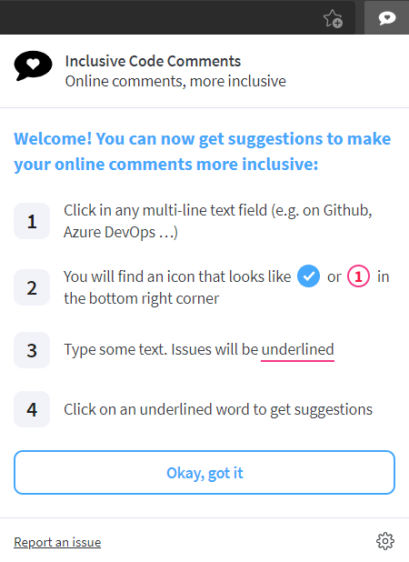
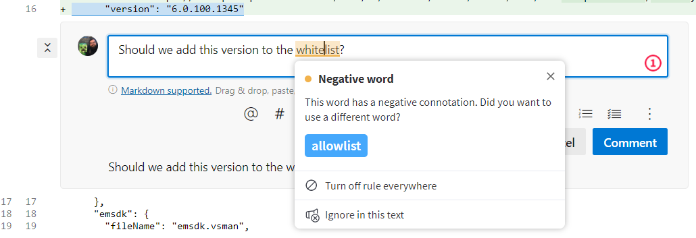
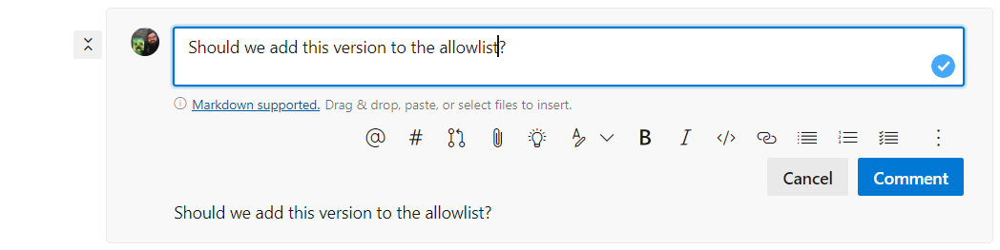
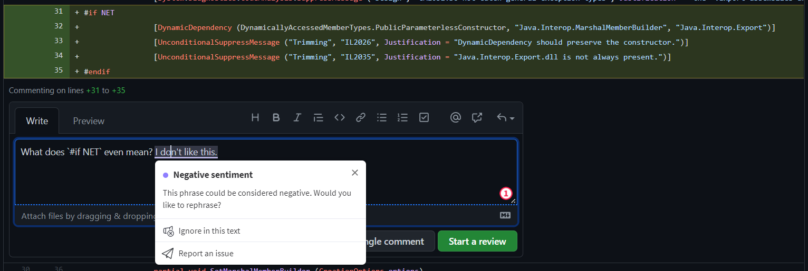
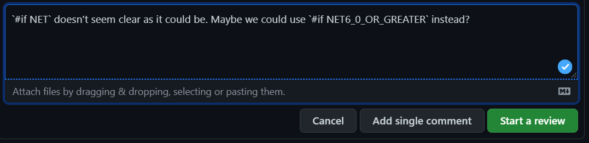
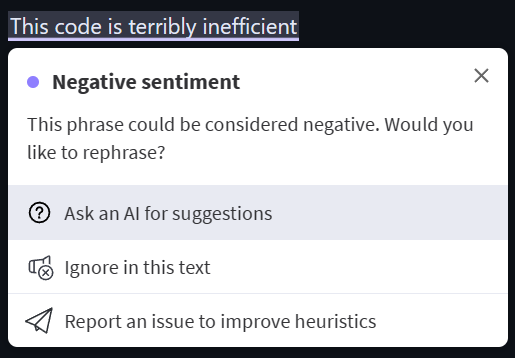
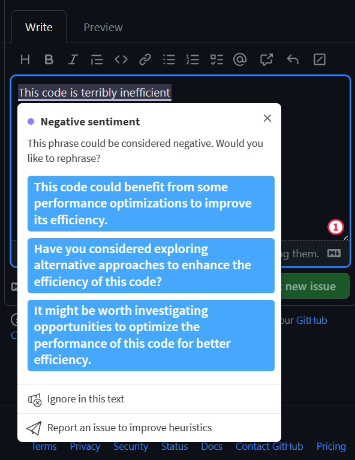
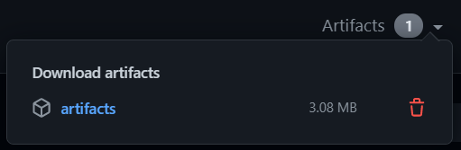
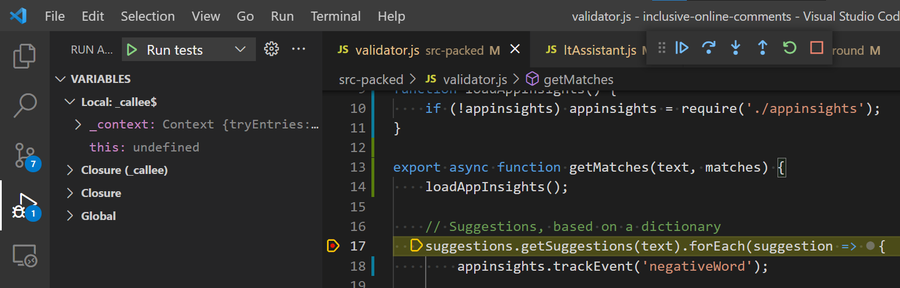

# Inclusive Code Reviews: Browser Extension

A *prototype* Chrome and Edge web extension for improving online comments such
as code reviews on Github or Azure DevOps. The idea is that the
extension would make suggestions *before* you post a comment. This
gives developers a chance to think about their phrasing and reword the
comment.



For example, you might use the term "whitelist" in a code review on
Azure DevOps:



The word "allowlist" might be better (and more inclusive) terminology:



We welcome changes to [suggestions.js](src-packed/suggestions.js), if
you know other words and terminology we can suggest. Please send a PR!

## Sentiment Analysis

In addition to checking commonly-used words, your comments are
classified by [our custom machine learning model][model]. We are
hoping to get a somewhat accurate model that is OK with "there was a
test failure", but not OK with "you are a failure". Standard sentiment
analysis wasn't good enough for our usage.

Note that the model runs *inside* the browser extension, and your actual text is
not ever sent across the Internet (see [OpenAI below](#openai) for one exception
to this). Some anonymous telemetry is collected for general usage of the
extension, see [telemetry.md](docs/telemetry.md) for details.

For example, you might make a comment on a Github pull request. Seems
OK, right? Is it a "mean" comment?



We could certainly reword this be be better -- more inclusive and
generally friendlier:



[model]: https://github.com/jonathanpeppers/inclusive-code-reviews-ml

## OpenAI

There is now a feature to query OpenAI available in version 3.1 or higher of the
browser extension.

This enables suggestions to phrases we have identified as negative sentiment:





Users will have control of which text is sent over the Internet, by clicking the
button (or not!).

## Contributing

This is built using the `extension-cli` module:

https://www.npmjs.com/package/extension-cli

To setup your API key, create a `src-packed/secrets.js` file with:

    export const api_key = "<put the real key here>";
    export const appinsights_key = "<put the app insights connection string here>";

_NOTE: you can also just use empty string values `""`, if you want to
contribute without API keys. This *should* work fine for the latest
version of the extension._

Make sure you have a recent version of `node.js`, you can [install
here](https://nodejs.org/en/download/current/).

To build:

    npm install
    npx xt-build

If the build fails with an error like this:

    Error: Cannot find module 'webpack/lib/ProgressPlugin'

then do this:

    npm i webpack

To run tests:

    npx xt-test

If you don't want to build the extension from source, you can also
download build artifacts from Github actions:



To install in Edge:

1. Navigate to `edge://extensions/`
1. Enable the `Developer Mode` toggle in the bottom left
1. Drag the `release.zip` file produced by the build into Edge.

Instructions should be similar for Google Chrome.

## Development Tips

You can use the debugging menu in VS Code to run tests:



This allows breakpoints to work, as well as looking at the value of current variables.

If the build fails with:

```
npx xt-build
Error: Cannot find module 'webpack/lib/ProgressPlugin'
Require stack:
- ~/src/inclusive-code-comments/node_modules/webpack-stream/index.js
- ~/src/inclusive-code-comments/node_modules/extension-cli/cli/gulpfile.js
- ~/src/inclusive-code-comments/node_modules/gulp-cli/lib/shared/require-or-import.js
- ~/src/inclusive-code-comments/node_modules/gulp-cli/lib/versioned/^4.0.0/index.js
- ~/src/inclusive-code-comments/node_modules/gulp-cli/index.js
- ~/src/inclusive-code-comments/node_modules/gulp/bin/gulp.js
    at Function.Module._resolveFilename (internal/modules/cjs/loader.js:1030:15)
    at Function.Module._load (internal/modules/cjs/loader.js:899:27)
    at Module.require (internal/modules/cjs/loader.js:1090:19)
    at require (internal/modules/cjs/helpers.js:75:18)
    at Object.<anonymous> (~/src/inclusive-code-comments/node_modules/webpack-stream/index.js:10:24)
    at Module._compile (internal/modules/cjs/loader.js:1201:30)
    at Object.Module._extensions..js (internal/modules/cjs/loader.js:1221:10)
    at Module.load (internal/modules/cjs/loader.js:1050:32)
    at Function.Module._load (internal/modules/cjs/loader.js:938:14)
    at Module.require (internal/modules/cjs/loader.js:1090:19) {
  code: 'MODULE_NOT_FOUND',
  requireStack: [
    '~/src/inclusive-code-comments/node_modules/webpack-stream/index.js',
    '~/src/inclusive-code-comments/node_modules/extension-cli/cli/gulpfile.js',
    '~/src/inclusive-code-comments/node_modules/gulp-cli/lib/shared/require-or-import.js',
    '~/src/inclusive-code-comments/node_modules/gulp-cli/lib/versioned/^4.0.0/index.js',
    '~/src/inclusive-code-comments/node_modules/gulp-cli/index.js',
    '~/src/inclusive-code-comments/node_modules/gulp/bin/gulp.js'
  ]
}
Build failed
```

You might need to update `node.js`. `node -v` should report node 16 or higher.
`brew upgrade node` (homebrew) is one way to update this on macOS.

## Links & Docs

Inclusive Code Reviews Group links

* [Beta Test Instructions](https://dev.azure.com/devdiv/DevDiv/_wiki/wikis/DevDiv.wiki/27882/Browser-Extension?anchor=beta-test)
* [Azure DevOps dashboard](https://dataexplorer.azure.com/dashboards/a8390f81-19c6-4bf5-bbd6-1a84cf03d80c?_startTime=30days&_endTime=now#a32efffa-608f-4ad9-b685-4b414b5c305b): has a few queries for looking at telemetry.

Extension CLI

* https://www.npmjs.com/package/extension-cli

Inclusive Code Reviews ML

* https://github.com/jonathanpeppers/inclusive-code-reviews-ml

## Attribution

This is a prototype based on:

* https://languagetool.org/
* [Chrome Extension](https://chrome.google.com/webstore/detail/grammar-and-spell-checker/oldceeleldhonbafppcapldpdifcinji)
* [Github Repo](https://github.com/languagetool-org/languagetool)
* See [LICENSE](LICENSE) for original GPL license.
